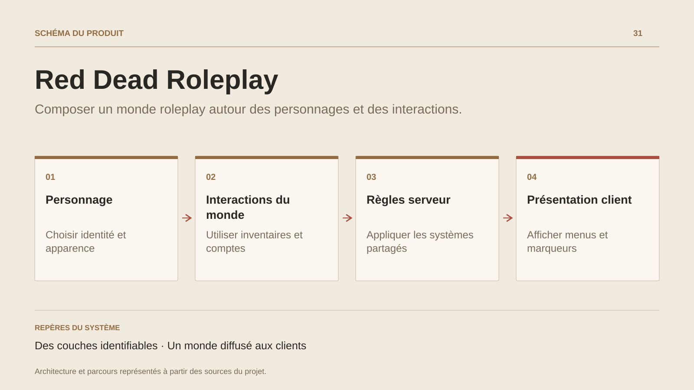

# Red Dead Roleplay

**Composer un monde roleplay autour des personnages et des interactions.**

[Tous les projets](../README.md#tout-latelier) · [English](red-dead-roleplay.en.md)

Red Dead Roleplay prolonge le travail sur les mondes communautaires dans l’environnement RedM. Les sources réunissent un créateur de personnage, des apparences, des inventaires, des comptes bancaires, des portes et des zones d’interaction.

Le serveur organise les modèles persistants, les services métier et la diffusion des entités. Le client prend en charge les menus natifs, les entrées du joueur, les marqueurs, les animations et différents comportements du monde, dont la pêche et les trains. Les éléments partagés relient les commandes et les événements des deux côtés.

La fiche présente un projet collaboratif historique à partir de ses sources conservées. L’intérêt technique réside dans la composition des systèmes et leur adaptation au moteur ; l’état d’un serveur public actuel reste à vérifier.

## Parcours

1. Créer ou retrouver le personnage et son apparence.
2. Utiliser les inventaires, les comptes et les interactions du monde.
3. Relier les règles serveur aux menus, aux marqueurs et aux événements côté jeu.

## Décisions de conception

### Des couches identifiables

Les sources regroupent le client, les services serveur et les contrats partagés. Le code de présentation et les modèles persistants ont leurs emplacements propres.

### Un monde diffusé aux clients

Les streamers et partitions spatiales organisent les entités, marqueurs et interactions à communiquer aux joueurs.

## Technologies

C# · RedM · Client / Server

**État :** Projet collaboratif · couches client, serveur et contrats.

[Retour à l’atelier](../README.md#tout-latelier) · [Studio & services ↗](https://floriansola.fr)
