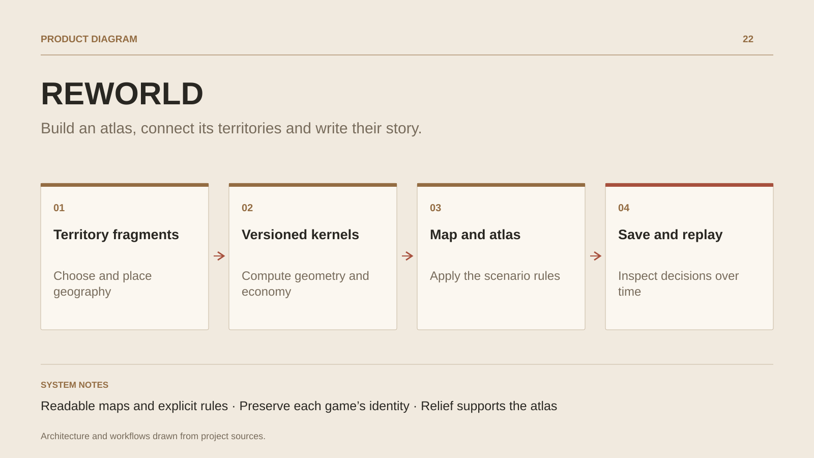

# REWORLD

**Build an atlas, connect its territories and write their story.**

[All projects](../README.en.md#the-whole-workshop) · [Français](reworld.md)

REWORLD starts with a concrete action: choose a fragment, rotate it and confirm its position on the map. The atlas grows through its territories, routes and federations. Scenarios introduce geographical estimation or trading companies and their Council; a chapter-based campaign guides progression. Journals, saves and replays let players revisit and inspect a game. The Studio supports scenario creation. Stylised relief makes the world readable, while versioned kernels calculate geometry and economic rules.

## Journey

1. **Choose an adventure.** Open The New Atlas, an estimation scenario, trading companies or a campaign chapter.
2. **Place a territory.** Select a fragment, move its anchor, adjust its rotation and confirm. Panning the map does not place a territory.
3. **Read the consequences.** Inspect routes and federations, then the journal or Council when enabled by the scenario’s rules.
4. **Revisit the game.** Save, inspect a replay, export the atlas or extend the experience with a Studio scenario.

## Design decisions

### Readable maps and explicit rules

WebGL2 displays relief, coastlines and settlements. Hector kernels decide geometry, routes and rules; a display preference does not change the game.

### Preserve each game’s identity

The server explicitly selects the engine matching a save format. New rules do not silently rewrite historical scenarios.

## Technology

JavaScript · WebGL2 · HECTOR · WebAssembly · SQLite

**Status :** In development · atlas, scenarios and campaign.

[Back to the workshop](../README.en.md#the-whole-workshop) · [Studio & services ↗](https://floriansola.fr/en)
