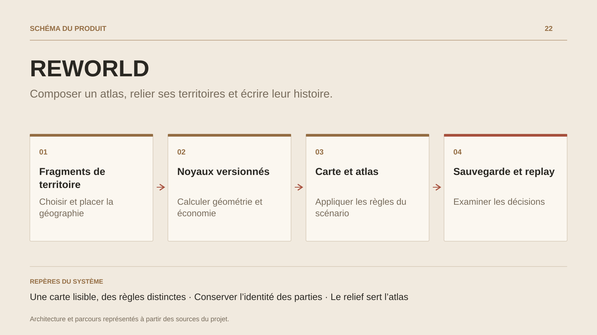

# REWORLD

**Composer un atlas, relier ses territoires et écrire leur histoire.**

[Tous les projets](../README.md#tout-latelier) · [English](reworld.en.md)

REWORLD commence par un geste concret : choisir un fragment, le tourner et confirmer son placement sur la carte. Le nouvel atlas prend forme au fil des territoires, de leurs routes et de leurs regroupements.

Des scénarios introduisent l’estimation géographique ou les compagnies marchandes et leur Conseil ; une campagne organise la progression par chapitres. Le carnet, les sauvegardes et les replays permettent de retrouver et d’examiner une partie.

Le Studio sert à composer des scénarios. Le relief stylisé rend le monde lisible tandis que les règles de géométrie et d’économie restent calculées dans des noyaux versionnés.

## Parcours

1. **Choisir une aventure.** Ouvrir Le Nouvel Atlas, un scénario d’estimation, les compagnies marchandes ou un chapitre de campagne.
2. **Placer un territoire.** Sélectionner un fragment, déplacer l’ancre, régler sa rotation et confirmer le placement. La carte peut être déplacée sans poser de territoire.
3. **Lire les conséquences.** Consulter les routes et fédérations, puis le carnet ou le Conseil lorsque les règles du scénario les activent.
4. **Retrouver la partie.** Sauvegarder, consulter le replay, exporter l’atlas ou prolonger l’expérience avec un scénario du Studio.

## Décisions de conception

### Une carte lisible, des règles distinctes

Le rendu WebGL2 représente relief, côtes et établissements. Les noyaux Hector décident de la géométrie, des routes et des règles ; une préférence visuelle ne change pas une partie.

### Conserver l’identité des parties

Le serveur choisit explicitement le moteur correspondant au format de sauvegarde. Les nouvelles règles ne réécrivent pas silencieusement les scénarios historiques.

## Technologies

JavaScript · WebGL2 · HECTOR · WebAssembly · SQLite

**État :** En développement · atlas, scénarios et campagne.

[Retour à l’atelier](../README.md#tout-latelier) · [Studio & services ↗](https://floriansola.fr)
