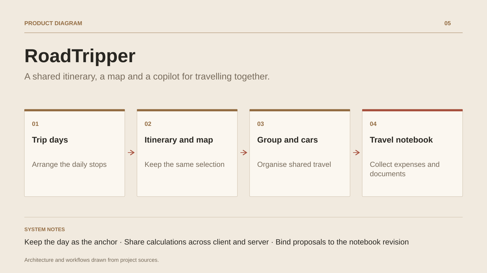

# RoadTripper

**A shared itinerary, a map and a copilot for travelling together.**

[All projects](../README.en.md#the-whole-workshop) · [Français](roadtripper.md)

RoadTripper follows a trip from the first idea to the days on the road. Travellers compose an itinerary from individual stops, inspect places and routes, and keep the same day and selection when switching between the list and the map.

The group brings together travellers and cars, invitations and roles, place suggestions and convoy coordination. A practical notebook collects reservations, expenses, documents, preparation and a travel journal.

The copilot helps enrich or adapt an itinerary through explicit requests and sourced places, with proposals kept for review. RoadTripper continues the MyRoadTrip product through an architecture rebuilt around a shared domain, a gateway and the Hector calculation engine.

## Journey

1. **Build the trip.** Create a notebook with dates and preferences, organise stops by day, and add places, breaks and overnight stays.
2. **Move between itinerary and map.** Select a day, inspect a stop and find it on the map without losing the selection. Calculate or refresh a route when a provider is configured.
3. **Prepare together.** Invite members with a role, assign travellers to cars, review departure preparation and collect reservations, documents and the budget.
4. **Adapt the itinerary.** Suggest a place to the group or ask the copilot for a detour. Review changes against the current notebook before adopting them, and share location only with consent.
5. **Keep expenses clear.** Record expenses, their shares and declared reimbursements, while keeping committed, estimated and recorded amounts distinct.

## Design decisions

### Keep the day as the anchor

The overview, itinerary and map share the selected day and stop identifiers. On mobile, the next action comes before secondary tools, and a stop opens for reading before editing.

### Share calculations across client and server

The notebook domain is independent of the interface. Hector, compiled to WebAssembly, provides deterministic planning, budget and progress calculations; the gateway validates incoming data again.

## Technology

TypeScript · Node.js · HECTOR · WebAssembly · SQLite · Capacitor · Android / iOS

**Status :** R21 · shared trip journal, itinerary, map and budget.

[Back to the workshop](../README.en.md#the-whole-workshop) · [Studio & services ↗](https://floriansola.fr/en)
