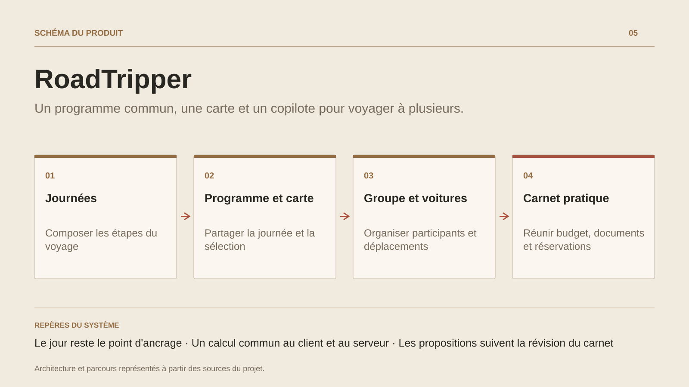

# RoadTripper

**Un programme commun, une carte et un copilote pour voyager à plusieurs.**

[Tous les projets](../README.md#tout-latelier) · [English](roadtripper.en.md)

RoadTripper accompagne le voyage depuis la première idée jusqu'aux journées sur la route. On compose un programme par étapes, on consulte les lieux et les trajets, puis on retrouve le même jour et la même sélection entre la liste et la carte.

Le groupe rassemble voyageurs et voitures, invitations et rôles, propositions de lieux et coordination du convoi. Le carnet pratique réunit réservations, dépenses, documents, préparation et journal.

Le copilote aide à enrichir ou adapter un parcours à partir de demandes explicites et de lieux sourcés ; ses propositions restent à relire. Le projet prolonge MyRoadTrip avec une architecture reconstruite autour d'un domaine commun, d'une passerelle et du moteur de calcul Hector.

## Parcours

1. **Composer le voyage.** Créer un carnet avec les dates et les préférences, répartir les étapes par journée, puis ajouter les lieux, pauses et nuitées.
2. **Passer du programme à la carte.** Choisir une journée, ouvrir une étape en lecture et la retrouver sur la carte sans perdre sa sélection. Calculer ou actualiser le trajet quand un fournisseur est configuré.
3. **Préparer le départ ensemble.** Inviter les membres avec un rôle, affecter les voyageurs aux voitures, vérifier la préparation et rassembler réservations, documents et budget.
4. **Faire évoluer le parcours.** Proposer un lieu au groupe ou demander au copilote un détour. Relire les changements sur le carnet courant avant leur adoption ; partager sa position seulement après accord.
5. **Garder les comptes lisibles.** Enregistrer les dépenses, leurs parts et les remboursements déclarés ; distinguer les montants engagés, estimés et réellement saisis.

## Décisions de conception

### Le jour reste le point d'ancrage

L'accueil, le programme et la carte partagent la journée et les identifiants d'étapes. Sur mobile, la prochaine action précède les outils secondaires ; une fiche se consulte avant d'être modifiée.

### Un calcul commun au client et au serveur

Le domaine du carnet reste indépendant de l'interface. Hector, compilé en WebAssembly, porte les calculs déterministes de planning, budget et progression ; la passerelle valide à nouveau les données reçues.

## Technologies

TypeScript · Node.js · HECTOR · WebAssembly · SQLite · Capacitor · Android / iOS

**État :** R21 · carnet partagé, programme, carte et budget.

[Retour à l’atelier](../README.md#tout-latelier) · [Studio & services ↗](https://floriansola.fr)
