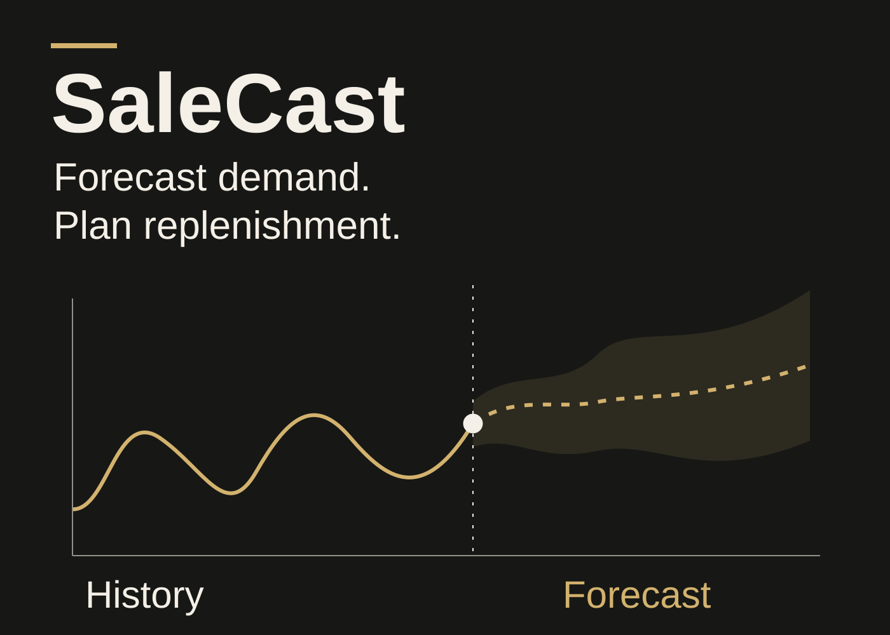
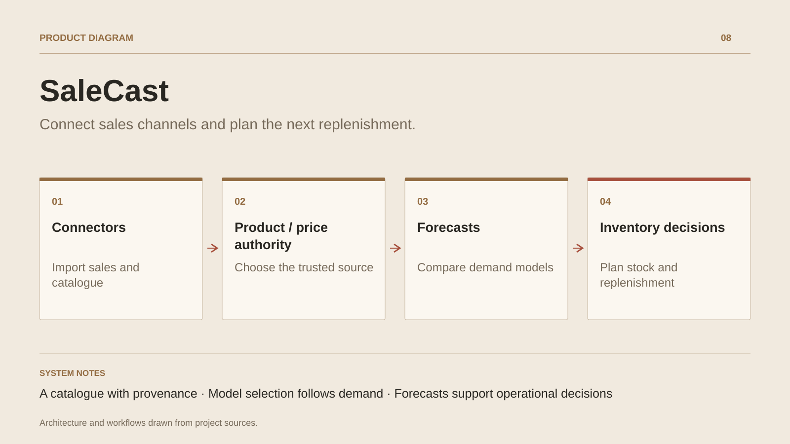

# SaleCast

**Connect sales channels and plan the next replenishment.**

[All projects](../README.en.md#the-whole-workshop) · [Français](salecast.md)

SaleCast supports commerce teams working with data from several platforms. Imported products are matched to a central catalogue, while orders remain searchable by channel, store, country, status and period. Authority modes determine whether SaleCast or the connector controls product data and pricing.

Forecast Studio processes product sales histories through preparation, demand classification, algorithm selection, backtesting and optional ensembles. It brings statistical methods, machine learning and time-series models together according to available capabilities. Analysis also includes ABC/XYZ segmentation, scenarios and quality monitoring.

Outputs support inventory decisions: safety stock, reorder points, coverage, stockout risk and suggested quantities. A shared engine serves web, desktop, CLI and API hosts.

## Journey

1. Connect stores and import products, orders and customers.
2. Match references in a central catalogue and set product and pricing authority.
3. Review orders by store, status, period or carrier.
4. Analyse sales history and compare forecasting models for each product.
5. Review stockout risk, safety stock and suggested replenishment quantities.

## Design decisions

### A catalogue with provenance

Imported products retain their connector links. Central matching brings references and variants together and preserves an explicit manual match.

### Model selection follows demand

The engine prepares time series, classifies demand and compares candidates through backtesting when sufficient history is available. It selects a model or combines forecasts.

## Technology

.NET · Blazor · EF Core · PostgreSQL · ML.NET · ONNX

**Status :** In development · e-commerce operations and demand forecasting.

[Back to the workshop](../README.en.md#the-whole-workshop) · [Studio & services ↗](https://floriansola.fr/en)
