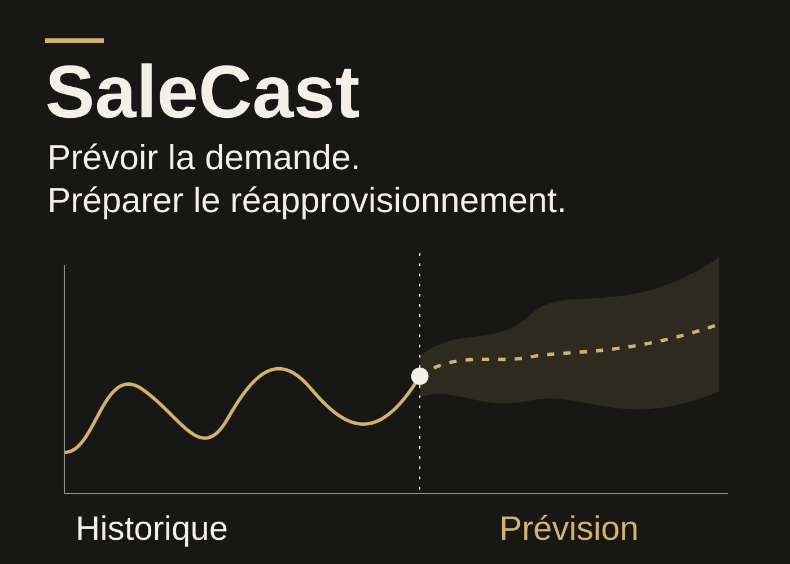
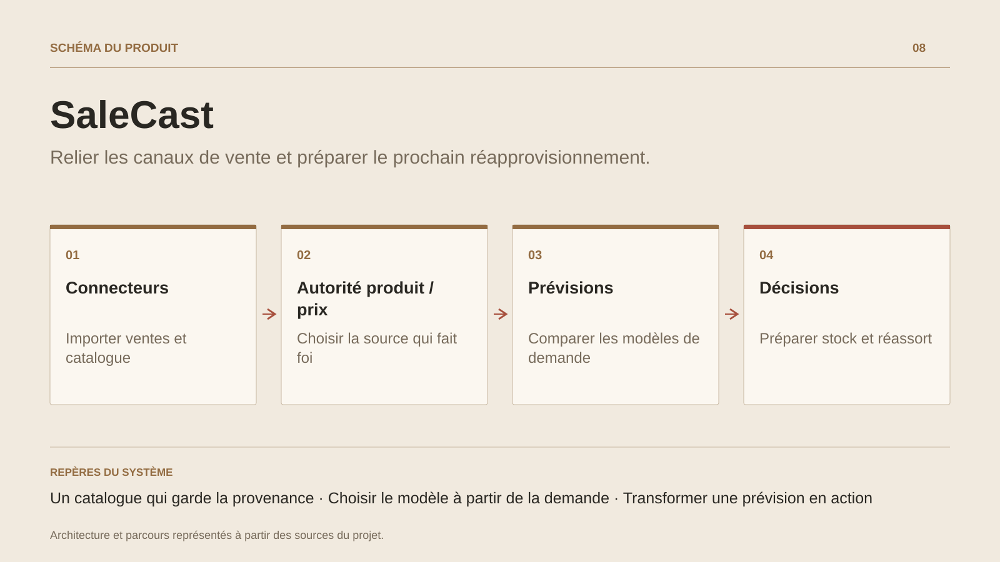

# SaleCast

**Relier les canaux de vente et préparer le prochain réapprovisionnement.**

[Tous les projets](../README.md#tout-latelier) · [English](salecast.en.md)

SaleCast organise le travail d'un commerce qui reçoit ses données de plusieurs plateformes. Les produits importés sont rapprochés dans un catalogue central, tandis que les commandes restent consultables par canal, boutique, pays, statut et période. Les modes d'autorité définissent si la donnée produit ou le prix est piloté dans SaleCast ou par le connecteur.

Le Forecast Studio traite ensuite les historiques produit : préparation des séries, classification de la demande, sélection des algorithmes, backtests et combinaison éventuelle de modèles. Il associe méthodes statistiques, modèles ML et modèles de séries temporelles selon les capacités disponibles. L'analyse couvre aussi la segmentation ABC/XYZ, les scénarios et le suivi de qualité.

Les résultats servent à préparer l'exploitation : stock de sécurité, point de commande, couverture, risque de rupture et quantité recommandée. Le moteur partagé dispose d'hôtes web, desktop, CLI et API, pour réutiliser les mêmes règles dans plusieurs contextes.

## Parcours

1. Connecter les boutiques et importer produits, commandes et clients.
2. Rapprocher les références dans un catalogue central et définir l'autorité des données produit et prix.
3. Examiner les commandes par boutique, statut, période ou transporteur.
4. Analyser l'historique de ventes et comparer les modèles de prévision par produit.
5. Consulter le risque de rupture, le stock de sécurité et les quantités de réapprovisionnement proposées.

## Décisions de conception

### Un catalogue qui garde la provenance

Chaque produit importé reste lié à son connecteur. Le rapprochement central réunit les références et variantes, avec un choix manuel conservé lorsque l'équipe l'a établi.

### Choisir le modèle à partir de la demande

Le moteur prépare les séries, distingue les profils de demande et compare les candidats par backtest lorsque l'historique le permet. Il peut retenir un modèle ou combiner plusieurs prévisions.

## Technologies

.NET · Blazor · EF Core · PostgreSQL · ML.NET · ONNX

**État :** En développement · opérations e-commerce et prévision de demande.

[Retour à l’atelier](../README.md#tout-latelier) · [Studio & services ↗](https://floriansola.fr)
