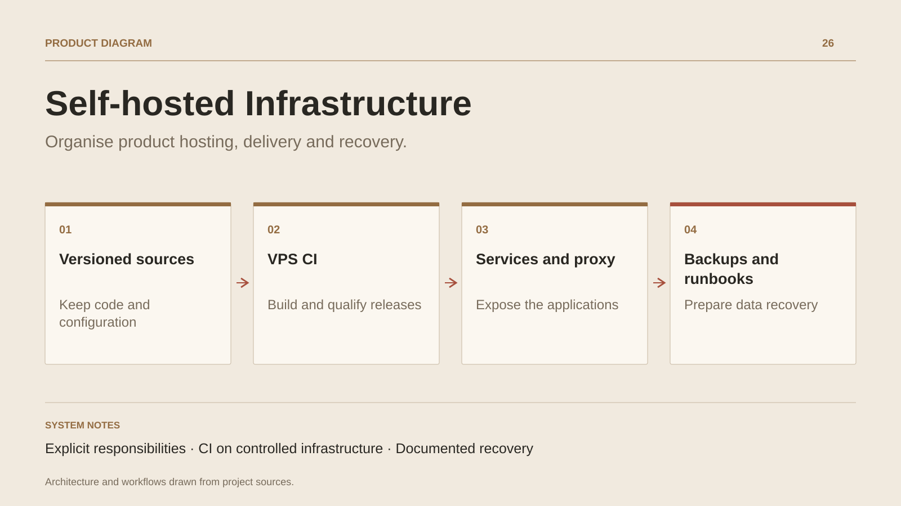

# Self-hosted Infrastructure

**Organise product hosting, delivery and recovery.**

[All projects](../README.en.md#the-whole-workshop) · [Français](self-hosted-infrastructure.md)

The self-hosted infrastructure brings together the responsibilities required to operate several products: expose applications, manage processes, host code and assets, build releases and preserve data. Configuration is versioned alongside deployment scripts and operational procedures.

Caddy handles domains and TLS; systemd organises services and resource budgets. Forgejo and LFS support sources and large assets. CI workflows remain on VPS runners, with isolation and capacity policies adapted to this environment.

Recovery has its own workflow. Bootstrap scripts, backups and runbooks describe how to bring configuration, applications and data together again. This case study covers the foundation and its procedures; rebuild timing and restoration quality are measured in an actual recovery exercise.

## Journey

1. Version service and reverse proxy configuration.
2. Build and qualify applications on VPS runners.
3. Deploy with health checks and prepare recovery procedures.

## Design decisions

### Explicit responsibilities

System configuration, application sources, secrets and data follow separate lifecycles. Procedures connect them during delivery or recovery.

### CI on controlled infrastructure

Jobs stay on the VPS. Runner rules and systemd budgets organise their resources alongside application services.

## Technology

Linux · Docker · Caddy · PostgreSQL · Forgejo · GitHub Actions

**Status :** Operations foundation · hosting, CI and backups.

[Back to the workshop](../README.en.md#the-whole-workshop) · [Studio & services ↗](https://floriansola.fr/en)
