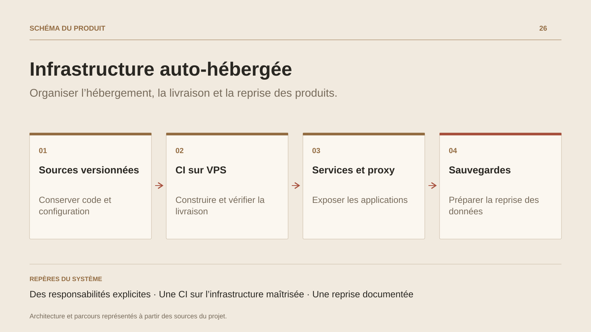

# Infrastructure auto-hébergée

**Organiser l’hébergement, la livraison et la reprise des produits.**

[Tous les projets](../README.md#tout-latelier) · [English](self-hosted-infrastructure.en.md)

L’infrastructure auto-hébergée rassemble les responsabilités nécessaires pour faire vivre plusieurs produits : exposer les applications, gérer leurs processus, héberger le code et les ressources, construire les versions et conserver les données. La configuration est versionnée avec les scripts de déploiement et les procédures d’exploitation.

Caddy porte les domaines et le TLS ; systemd organise les services et leurs ressources. Forgejo et LFS accompagnent les sources et les actifs volumineux. Les workflows de CI restent sur les runners VPS, avec des règles d’isolation et de capacité adaptées à cet environnement.

La reprise est un travail à part entière : le bootstrap, les sauvegardes et les runbooks décrivent comment réunir configuration, applications et données. La fiche présente ce socle et ses procédures ; les délais de reconstruction et la qualité d’une restauration se mesurent lors d’un exercice réel.

## Parcours

1. Versionner la configuration des services et du reverse proxy.
2. Construire et qualifier les applications sur les runners VPS.
3. Déployer avec contrôle de santé et préparer les procédures de reprise.

## Décisions de conception

### Des responsabilités explicites

Configuration système, sources applicatives, secrets et données suivent des cycles séparés. Les procédures relient ces éléments au moment d’une livraison ou d’une reprise.

### Une CI sur l’infrastructure maîtrisée

Les jobs restent sur le VPS. Les règles de runner et les budgets systemd organisent leurs ressources face aux services applicatifs.

## Technologies

Linux · Docker · Caddy · PostgreSQL · Forgejo · GitHub Actions

**État :** Socle d’exploitation · hébergement, CI et sauvegardes.

[Retour à l’atelier](../README.md#tout-latelier) · [Studio & services ↗](https://floriansola.fr)
