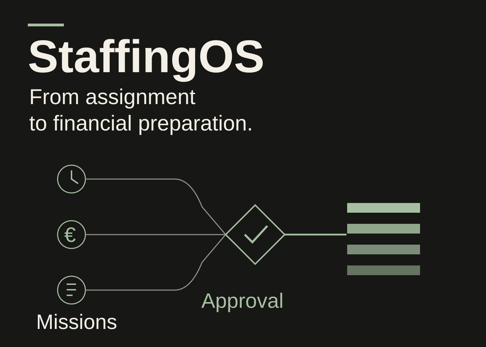
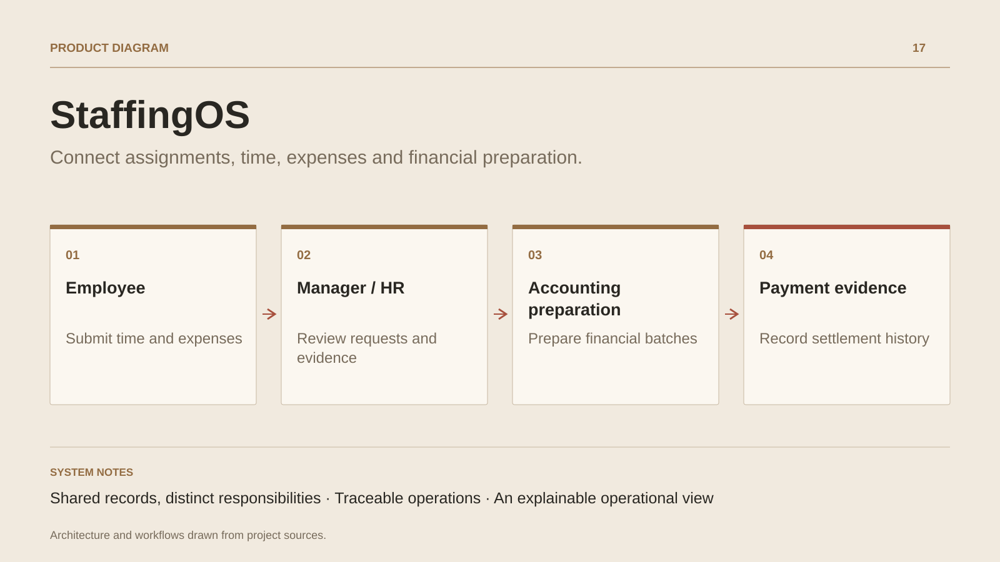

# StaffingOS

**Connect assignments, time, expenses and financial preparation.**

[All projects](../README.en.md#the-whole-workshop) · [Français](staffingos.md)

StaffingOS follows the lifecycle of an organisation assigning people to client work. Client accounts, sites, requirements and people feed assignments, periods and versioned rates. Daily work continues through timesheets, expenses, absence requests and review workflows.

Workspaces organise actions by role. Workers access their assignments and entries; managers review requests within their scope. The Operations view brings period checks and exception queues together with links to the relevant records.

Financial workflows prepare payroll, preinvoices and provider transmissions. A payment register retains evidence reviewed by the operator. Audit, command identities and durable events accompany operations and recovery.

## Journey

1. Record the client, site, requirement and assigned person.
2. Create the assignment with dates and versioned rates.
3. Submit time, expenses and absence requests through authorised workspaces.
4. Review requests and exceptions through approval workflows.
5. Prepare payroll and preinvoice batches, then record payment evidence.

## Design decisions

### Shared records, distinct responsibilities

Workers, managers, HR and accounting act on shared records with explicit permissions and scopes. Assignment, time and absence rules are shared across interfaces.

### Traceable operations

Assignment creation records a command fingerprint, versions, audit and durable events in one transaction. Recovery distinguishes new work from replay of an existing operation.

## Technology

C# · .NET 10 · Blazor · ActualLab Fusion · PostgreSQL

**Status :** In development · HR, operations and accounting workflows.

[Back to the workshop](../README.en.md#the-whole-workshop) · [Studio & services ↗](https://floriansola.fr/en)
