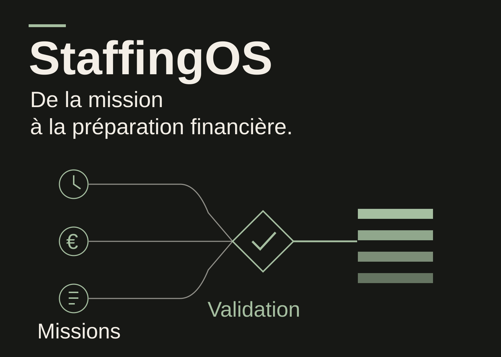
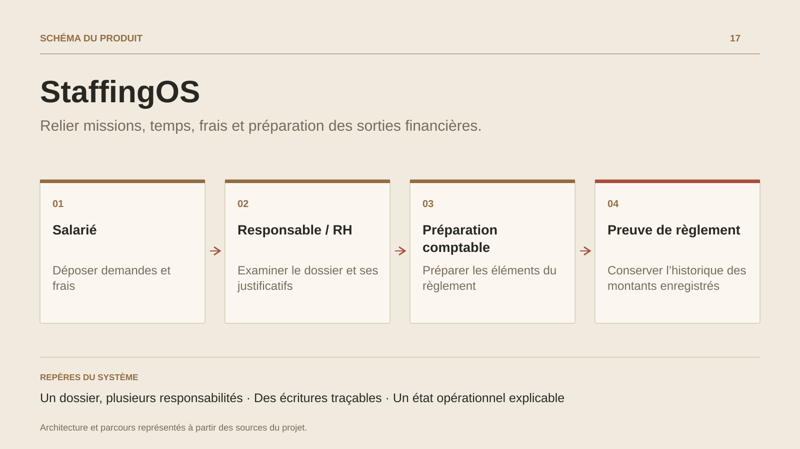

# StaffingOS

**Relier missions, temps, frais et préparation des sorties financières.**

[Tous les projets](../README.md#tout-latelier) · [English](staffingos.en.md)

StaffingOS suit le cycle d'une organisation qui place des collaborateurs chez ses clients. Comptes clients, sites, besoins et personnes alimentent les missions, leurs périodes et leurs tarifs versionnés. Le quotidien se poursuit dans les feuilles de temps, notes de frais, demandes d'absence et circuits d'examen.

Les espaces de travail organisent les actions par rôle. Le collaborateur consulte ses propres missions et écritures ; les responsables et gestionnaires examinent les demandes sur leur périmètre. La vue Opérations réunit contrôles de période et file d'exceptions, avec des liens vers les dossiers concernés.

Le volet financier prépare prépaie, préfacturation et transmissions. Le registre de règlements conserve les preuves examinées par le gestionnaire. Audit, identités de commande et événements durables accompagnent les opérations et leurs reprises.

## Parcours

1. Enregistrer le client, son site, le besoin et la personne affectée.
2. Créer la mission avec ses dates et ses versions tarifaires.
3. Saisir les temps, frais et demandes d'absence depuis les espaces autorisés.
4. Examiner les demandes et exceptions dans les circuits de validation.
5. Préparer les lots de prépaie et préfacturation, puis enregistrer les preuves de règlement.

## Décisions de conception

### Un dossier, plusieurs responsabilités

Le salarié, le responsable, les RH et la comptabilité interviennent sur les mêmes dossiers avec des droits et des périmètres explicites. Les règles de mission, de temps et d'absence sont partagées entre interfaces.

### Des écritures traçables

La création d'une mission associe empreinte de commande, versions, audit et événements durables dans une transaction. Les reprises distinguent une nouvelle action du rejeu d'une action déjà enregistrée.

## Technologies

C# · .NET 10 · Blazor · ActualLab Fusion · PostgreSQL

**État :** En développement · parcours RH, opérations et comptabilité.

[Retour à l’atelier](../README.md#tout-latelier) · [Studio & services ↗](https://floriansola.fr)
