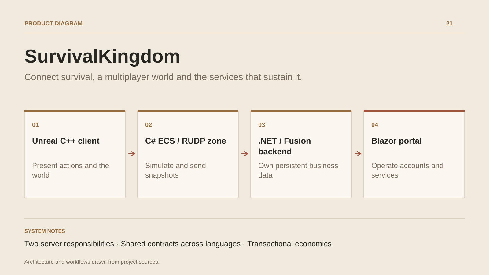

# SurvivalKingdom

**Connect survival, a multiplayer world and the services that sustain it.**

[All projects](../README.en.md#the-whole-workshop) · [Français](survival-kingdom.md)

SurvivalKingdom develops a survival world in which character needs, equipment, resources and buildings support multiplayer progression. The repository connects this Unreal core to a zone server simulating movement and combat, then a business backend handling economics, trades, presence and operations. A Blazor portal completes the web side. Contract generation connects C# messages to the client’s C++ structures. Systems have implementations and tests at different levels of completeness; playable integration, content and persistent journeys remain development work.

## Journey

1. **Enter the world.** The intended journey connects account identity, a character and admission to a zone.
2. **Survive and equip.** The gameplay core organises interaction, resources, inventory, equipment, crafting and character needs.
3. **Build and fight.** World actions and movement use authoritative simulation, with client prediction and reconciliation.
4. **Recover progression.** Business services and the portal support trade, account management and world operations; durable zone integration remains part of the work.

## Design decisions

### Two server responsibilities

The C# ECS/RUDP zone server owns real-time simulation. The .NET/Fusion backend owns business operations and persistence; each retains explicit contracts.

### Shared contracts across languages

A generator produces C# and C++ network structures from a common source. Drift checks accompany protocol changes.

## Technology

Unreal Engine · C++ · C# · .NET · ActualLab Fusion · Blazor

**Status :** In development · survival, zone simulation and services.

[Back to the workshop](../README.en.md#the-whole-workshop) · [Studio & services ↗](https://floriansola.fr/en)
