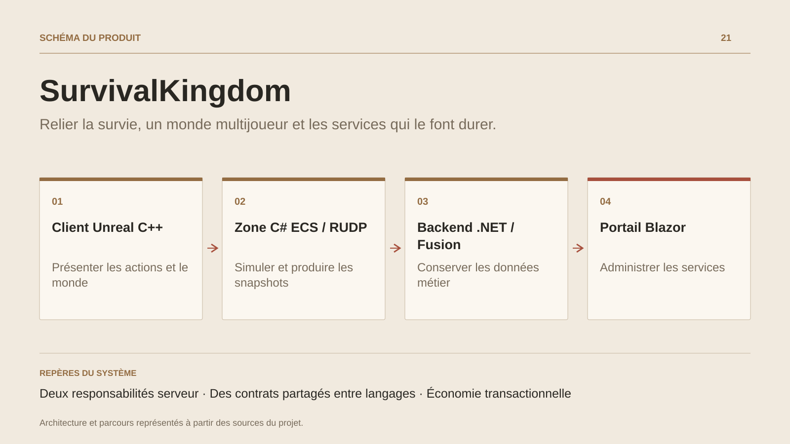

# SurvivalKingdom

**Relier la survie, un monde multijoueur et les services qui le font durer.**

[Tous les projets](../README.md#tout-latelier) · [English](survival-kingdom.en.md)

SurvivalKingdom développe un monde de survie où les besoins du personnage, son équipement, ses ressources et ses constructions s’inscrivent dans une progression multijoueur.

Le dépôt relie ce cœur Unreal à un serveur de zone qui simule déplacements et combats, puis à un backend métier chargé notamment de l’économie, des échanges, de la présence et des opérations. Un portail Blazor complète l’ensemble côté web. La génération de contrats relie les messages C# aux structures C++ du client.

Les systèmes disposent d’implémentations et de tests à des degrés différents ; l’intégration jouable, les contenus et les parcours persistants restent des chantiers de développement.

## Parcours

1. **Entrer dans le monde.** Le parcours visé relie une identité de compte, un personnage et son admission dans une zone.
2. **Survivre et s’équiper.** Le cœur de gameplay organise interaction, ressources, inventaire, équipement, fabrication et besoins du personnage.
3. **Construire et combattre.** Les actions de monde et les déplacements s’appuient sur une simulation autoritaire, avec prédiction et réconciliation côté client.
4. **Retrouver la progression.** Les services métier et le portail préparent les échanges, la gestion du compte et le suivi du monde ; leur raccordement durable fait partie de l’intégration.

## Décisions de conception

### Deux responsabilités serveur

Le serveur de zone C# ECS/RUDP porte le temps réel. Le backend .NET/Fusion porte les opérations métier et la persistance ; chacun conserve ses contrats.

### Des contrats partagés entre langages

Un générateur produit les structures réseau C# et C++ à partir d’une source commune. Les contrôles de dérive accompagnent les évolutions du protocole.

## Technologies

Unreal Engine · C++ · C# · .NET · ActualLab Fusion · Blazor

**État :** En développement · survie, simulation de zone et services.

[Retour à l’atelier](../README.md#tout-latelier) · [Studio & services ↗](https://floriansola.fr)
