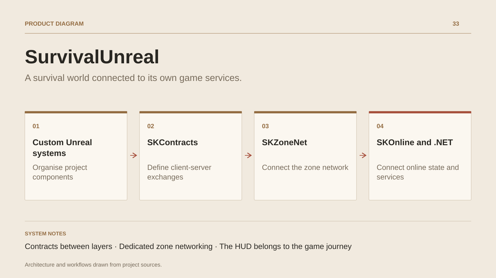

# SurvivalUnreal

**A survival world connected to its own game services.**

[All projects](../README.en.md#the-whole-workshop) · [Français](survival-unreal.md)

SurvivalUnreal develops the connection between what players see, the actions they request and the rules maintained by world services. The Unreal client owns movement, interaction and presentation; contract, networking and service layers organize exchanges with game hosts.

The work connects concrete domains: inventory-item identity, quest events, dialogue choices, building placement, world resources and progression. The HUD brings together gauges, targets, actions and experience, with an embedded-web bridge to C++ code.

The project has its own SKContracts, SKOnline and SKZoneNet modules, alongside Server, Realtime, Web and Codegen layers. Engine adapters and persistent systems have distinct responsibilities. Generated contracts make their integration explicit, while connection and recovery states belong to the player journey.

## Journey

1. **Enter the world.** Connect the player identity, session and zone state to the Unreal client.
2. **Interact with the world.** Send interaction requests, dialogue choices and game events to the services that own their rules.
3. **Follow progression.** Present character data, items and progression through interfaces and HUD gauges.
4. **Stay connected to the game.** Make connection, link-loss and recovery states understandable in the player interface.

## Design decisions

### Contracts between layers

SKContracts and code generation connect Unreal data to service layers. Item identity and game messages follow explicit contracts.

### Dedicated zone networking

SKZoneNet integrates world networking in the client. SKOnline connects game operations and data to services, while Realtime and Server organize the hosts.

## Technology

Unreal Engine · C++ · C# · .NET · Blazor · Code generation

**Status :** In development · Unreal gameplay, zone networking and HUD.

[Back to the workshop](../README.en.md#the-whole-workshop) · [Studio & services ↗](https://floriansola.fr/en)
