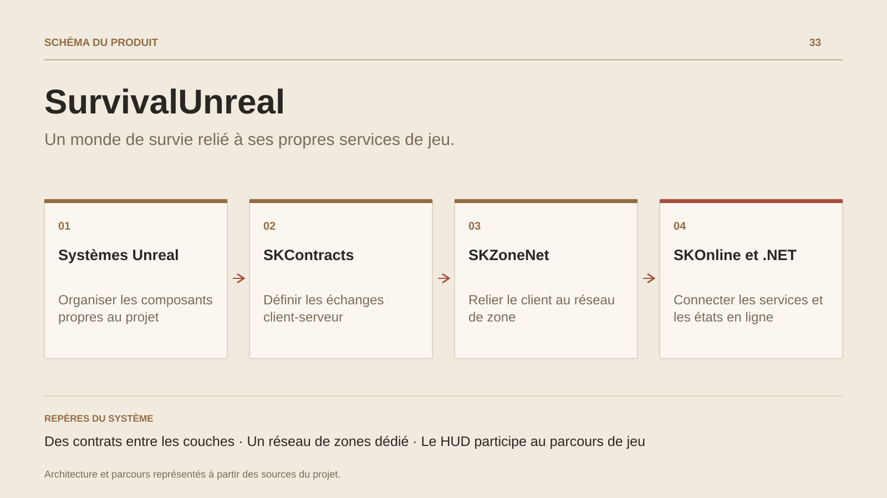

# SurvivalUnreal

**Un monde de survie relié à ses propres services de jeu.**

[Tous les projets](../README.md#tout-latelier) · [English](survival-unreal.en.md)

SurvivalUnreal travaille la relation entre ce que le joueur voit, les actions qu’il demande et les règles conservées par les services du monde. Le client Unreal assure le déplacement, les interactions et la présentation ; les couches de contrats, de réseau et de services organisent les échanges avec les hôtes de jeu.

Le développement relie plusieurs domaines concrets : identité des objets d’inventaire, événements de quête, choix de dialogue, placement de constructions, ressources du monde et progression. Le HUD rassemble les jauges, la cible, la barre d’actions et l’expérience, avec un pont entre la présentation web embarquée et le code C++.

Le projet possède ses modules SKContracts, SKOnline et SKZoneNet, ainsi que des couches Server, Realtime, Web et Codegen. Les adaptations moteur et les systèmes persistants ont des responsabilités distinctes ; les contrats générés rendent leur raccordement explicite. Les transitions de connexion et de reprise appartiennent au parcours du joueur, au même titre que les interactions de jeu.

## Parcours

1. **Entrer dans le monde.** Relier l’identité du joueur, sa session et les états de la zone au client Unreal.
2. **Interagir avec le monde.** Faire circuler les demandes d’interaction, les choix de dialogue et les événements de jeu vers les services qui en portent les règles.
3. **Retrouver sa progression.** Présenter les données de personnage, les objets et la progression dans les interfaces et les jauges du HUD.
4. **Rester connecté au jeu.** Rendre les états de connexion, de perte de liaison et de reprise lisibles depuis l’interface du joueur.

## Décisions de conception

### Des contrats entre les couches

SKContracts et la génération de code relient les données consommées par Unreal aux couches de services. L’identité des objets et les messages de jeu passent par des contrats explicites.

### Un réseau de zones dédié

SKZoneNet porte l’intégration du réseau de monde côté client. SKOnline relie les opérations et données de jeu aux services, tandis que Realtime et Server organisent leurs hôtes.

## Technologies

Unreal Engine · C++ · C# · .NET · Blazor · Code generation

**État :** En développement · gameplay Unreal, réseau de zones et HUD.

[Retour à l’atelier](../README.md#tout-latelier) · [Studio & services ↗](https://floriansola.fr)
