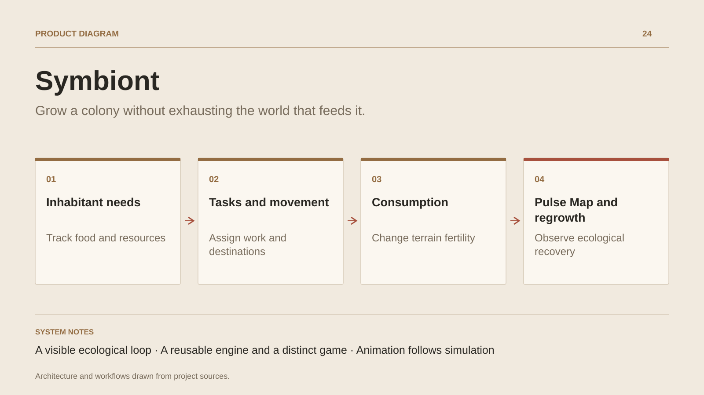

# Symbiont

**Grow a colony without exhausting the world that feeds it.**

[All projects](../README.en.md#the-whole-workshop) · [Français](symbiont.md)

Symbiont builds its first experience around a small colony on a procedural map. Players select inhabitants, give destinations and track the needs and tasks shaping daily life. Eating consumes local fertility; the ecological map reveals that cost and the terrain’s recovery. Construction, production, stockpiles, health and progression are developed as separate modules. The engine reuses Poisson foundations, while the application, isometric interface and colony rules establish the game’s own identity. Evolution toward collective forms of life remains part of its progression work.

## Journey

1. **Explore the terrain.** Start a procedural map and locate resources, water and accessible areas.
2. **Organise inhabitants.** Select a character, give a destination and track their needs and tasks.
3. **Read ecological pressure.** Open the Pulse Map to see consumption affecting fertility and the terrain recovering.
4. **Develop the colony.** Explore construction, production, storage and health in the developing slice, then save the game.

## Design decisions

### A visible ecological loop

Consumption changes the simulated terrain. The Pulse Map exposes that change and connects immediate comfort to future resources.

### A reusable engine and a distinct game

Engine, domain, shared simulation and game layers organise dependencies. Colony logic and its interface remain separate from inherited foundations.

## Technology

JavaScript · WebGPU · WebGL · Simulation

**Status :** Prototype · colony, needs and living environment.

[Back to the workshop](../README.en.md#the-whole-workshop) · [Studio & services ↗](https://floriansola.fr/en)
