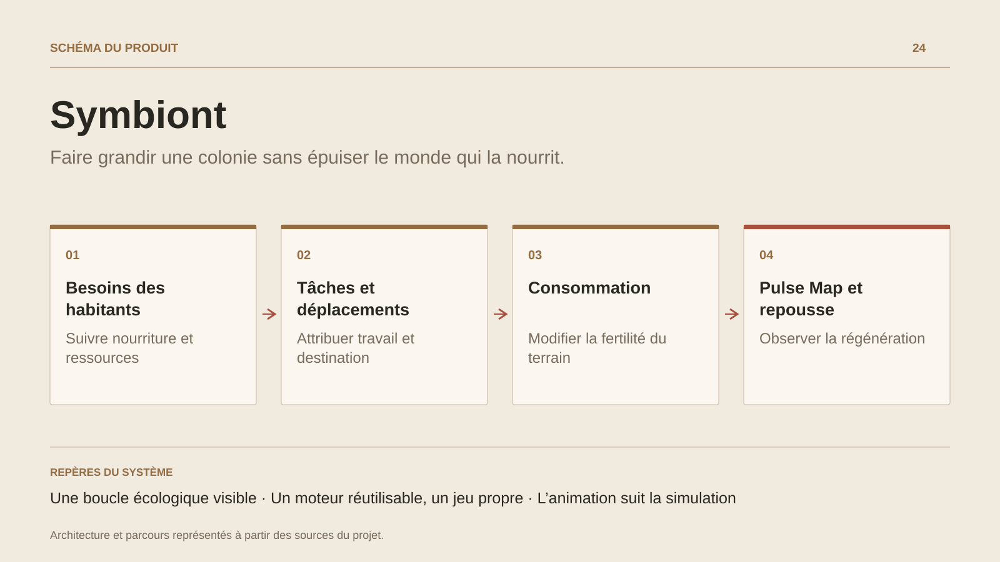

# Symbiont

**Faire grandir une colonie sans épuiser le monde qui la nourrit.**

[Tous les projets](../README.md#tout-latelier) · [English](symbiont.en.md)

Symbiont construit sa première expérience autour d’une petite colonie sur une carte procédurale. Le joueur sélectionne ses habitants, leur donne des destinations et suit leurs besoins ainsi que les tâches qui organisent leur quotidien.

Se nourrir consomme la fertilité locale ; la carte écologique fait apparaître ce coût et la régénération du terrain. Le jeu développe construction, production, stocks, santé et progression dans des modules distincts.

Son moteur réutilise des fondations de Poisson, tandis que l’application, l’interface isométrique et les règles de colonie lui donnent une identité propre. Le passage vers des formes de vie collectives appartient au développement de la progression du projet.

## Parcours

1. **Découvrir le terrain.** Démarrer une carte procédurale et repérer les ressources, l’eau et les zones accessibles.
2. **Organiser les habitants.** Sélectionner un personnage, lui donner un déplacement et suivre ses besoins ainsi que ses tâches.
3. **Mesurer la pression écologique.** Afficher la Pulse Map pour lire l’effet de la consommation sur la fertilité et sa régénération.
4. **Faire évoluer la colonie.** Explorer les systèmes de construction, production, stockage et santé de la tranche en développement, puis enregistrer la partie.

## Décisions de conception

### Une boucle écologique visible

La consommation modifie le terrain de simulation. La Pulse Map expose cette évolution au joueur et relie le confort immédiat aux ressources futures.

### Un moteur réutilisable, un jeu propre

Les couches moteur, domaine, simulation partagée et jeu organisent les dépendances. Le code de colonie et son interface restent distincts des fondations héritées.

## Technologies

JavaScript · WebGPU · WebGL · Simulation

**État :** Prototype · colonie, besoins et environnement vivant.

[Retour à l’atelier](../README.md#tout-latelier) · [Studio & services ↗](https://floriansola.fr)
