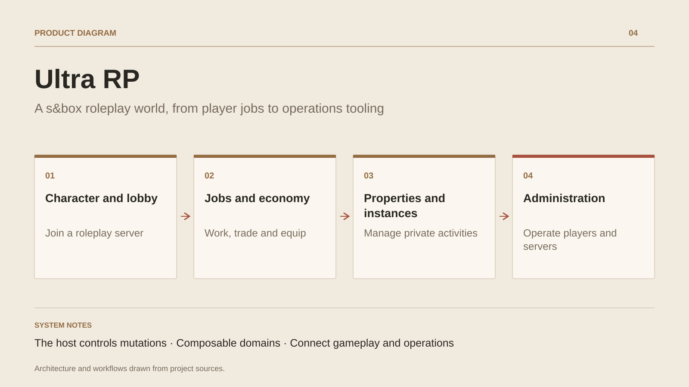

# Ultra RP

**A s&box roleplay world, from player jobs to operations tooling**

[All projects](../README.en.md#the-whole-workshop) · [Français](ultra-rp-sbox.md)

Ultra RP explores a complete roleplay world on s&box. Players join a session, return to a job, receive equipment and take part in an economy of salaries, purchases, inventory and property. Doors linked to a property inherit its ownership and access rules.

Dedicated C# systems support these flows. Property purchases and sales execute on the host, with caller resolution and distance checks. Job assignment applies level and slot requirements, then uses the economy system to pay salaries.

The repository also contains an ASP.NET backend, administration interface, React interfaces, a bot and a CLI. Private-activity routing connects the backend and lobbies, with a local demonstration path. The engineering interest is this continuity between gameplay, shared state and operations; concurrency targets are not treated as measured capacity.

## Journey

1. Join a lobby and return to a character.
2. Choose a job, receive equipment and take part in the server economy.
3. Buy or sell property, manage linked doors and enter a private activity.
4. Administer players and servers through dedicated tools.

## Design decisions

### The host controls mutations

Property purchases and ownership state go through host RPCs. The code resolves the caller and checks distance before the action.

### Composable domains

Jobs, inventory, economy, property and activities have dedicated systems. Salaries use the economy service, and properties propagate ownership to linked doors.

## Technology

s&box · C# · ASP.NET Core · EF Core · PostgreSQL · Redis · React

**Status :** In development · roleplay systems in s&box.

[Back to the workshop](../README.en.md#the-whole-workshop) · [Studio & services ↗](https://floriansola.fr/en)
