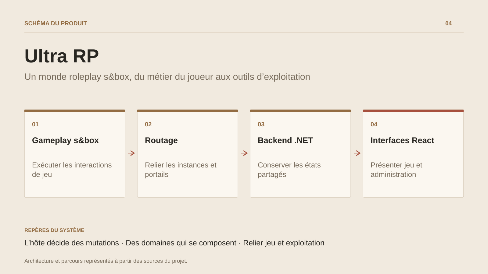

# Ultra RP

**Un monde roleplay s&box, du métier du joueur aux outils d’exploitation**

[Tous les projets](../README.md#tout-latelier) · [English](ultra-rp-sbox.en.md)

Ultra RP explore la construction d’un monde roleplay complet sur s&box. Le joueur rejoint une session, retrouve un métier, reçoit son équipement et participe à l’économie : salaires, achats, inventaire et propriétés. Les portes liées à une propriété héritent de sa possession et des règles d’accès.

Ces usages s’appuient sur des systèmes C# par domaine. L’achat et la vente d’une propriété sont exécutés par l’hôte, avec résolution de l’appelant et contrôle de distance. Le gestionnaire de métiers applique les conditions de niveau et de places disponibles, puis passe par l’économie pour les salaires.

Autour du jeu, le dépôt contient un backend ASP.NET, une interface d’administration, des interfaces React, un bot et une CLI. Le routage vers une activité privée relie backend et lobbies, avec un parcours local de démonstration. L’intérêt de ce chantier tient à cette continuité entre jeu, état partagé et exploitation ; les objectifs de joueurs simultanés ne sont pas présentés comme une capacité mesurée.

## Parcours

1. Rejoindre un lobby et retrouver son personnage.
2. Choisir un métier, recevoir son équipement et participer à l’économie du serveur.
3. Acheter ou vendre une propriété, gérer ses portes et accéder à une activité privée.
4. Administrer joueurs et serveurs depuis les outils dédiés.

## Décisions de conception

### L’hôte décide des mutations

Les achats de propriétés et l’état de possession passent par des RPC de l’hôte. Le code résout l’appelant et vérifie sa proximité avant l’action.

### Des domaines qui se composent

Métiers, inventaire, économie, propriétés et activités disposent de systèmes dédiés. Les salaires utilisent le service économique et les propriétés transmettent la possession aux portes liées.

## Technologies

s&box · C# · ASP.NET Core · EF Core · PostgreSQL · Redis · React

**État :** En développement · systèmes roleplay dans s&box.

[Retour à l’atelier](../README.md#tout-latelier) · [Studio & services ↗](https://floriansola.fr)
