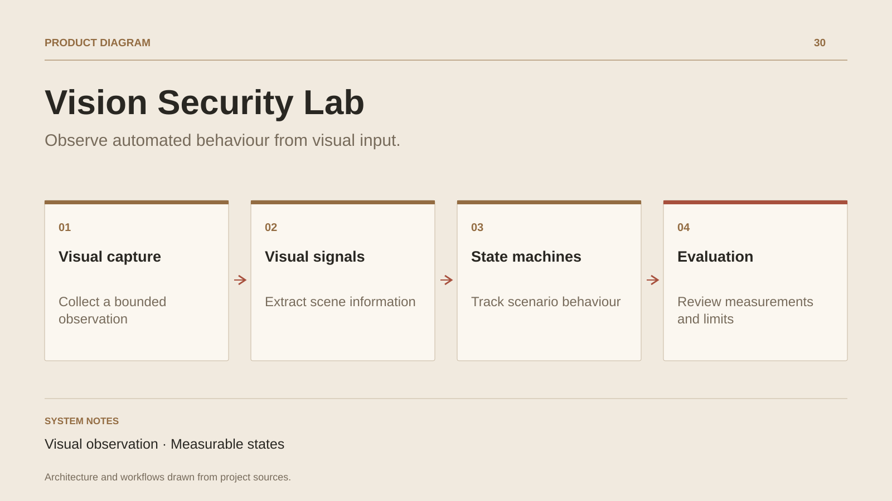

# Vision Security Lab

**Observe automated behaviour from visual input.**

[All projects](../README.en.md#the-whole-workshop) · [Français](vision-security-lab.md)

Vision Security Lab groups local experiments in scene perception and automated behaviour tracking. The laboratories describe a visual approach: capture, regions of interest, signal extraction and scenario state.

Measurement is part of the work. State machines, logs and dashboards help follow transitions, document working behaviour and identify partial features. Scenarios are evaluated in the test environments declared by each laboratory.

The sources contain several variants with different maturity levels. This case study preserves the research and its observation tooling; every result remains tied to its scenario and test conditions.

## Journey

1. Bound a test scene and its observation regions.
2. Extract visual signals and track scenario state.
3. Review measurements, behaviour and the feature matrix.

## Design decisions

### Visual observation

The laboratories describe an approach based on pixels, regions of interest and visual signals. The observation scope is explicit.

### Measurable states

State machines, logs and observation dashboards connect behaviour to the scenario that produced it.

## Technology

Rust · Python · Computer vision · State machines

**Status :** Laboratory · vision, state and evaluation.

[Back to the workshop](../README.en.md#the-whole-workshop) · [Studio & services ↗](https://floriansola.fr/en)
