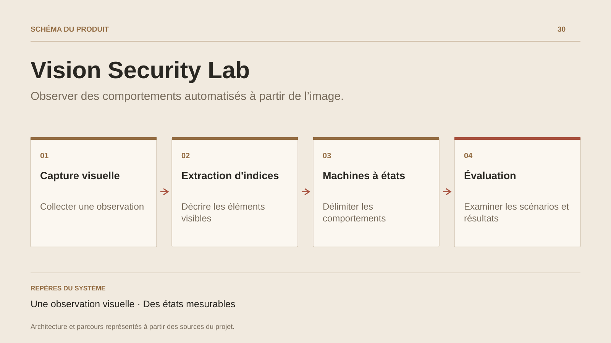

# Vision Security Lab

**Observer des comportements automatisés à partir de l’image.**

[Tous les projets](../README.md#tout-latelier) · [English](vision-security-lab.en.md)

Vision Security Lab regroupe des expérimentations locales sur la perception d’une scène et le suivi de comportements automatisés. Les laboratoires décrivent une approche visuelle : capture, zones d’intérêt, extraction d’indices et état du scénario.

Le travail porte aussi sur la mesure. Les machines à états, les journaux et les tableaux de bord permettent de suivre les transitions, de documenter ce qui fonctionne et de repérer les fonctions encore partielles. Les scénarios sont évalués dans les environnements de test déclarés par chaque laboratoire.

Les sources présentent plusieurs variantes avec des niveaux de maturité différents. La fiche conserve ce terrain de recherche et son outillage d’observation ; chaque résultat reste lié à son scénario et à ses conditions de test.

## Parcours

1. Délimiter une scène de test et ses zones d’observation.
2. Extraire les indices visuels et suivre l’état du scénario.
3. Examiner les mesures, les comportements et la matrice de fonctionnalités.

## Décisions de conception

### Une observation visuelle

Les laboratoires décrivent une approche fondée sur les pixels, les zones d’intérêt et les indices visuels. Le périmètre d’observation est explicite.

### Des états mesurables

Les machines à états, journaux et tableaux d’observation permettent de rapprocher un comportement du scénario qui l’a produit.

## Technologies

Rust · Python · Computer vision · State machines

**État :** Laboratoire · vision, états et évaluation.

[Retour à l’atelier](../README.md#tout-latelier) · [Studio & services ↗](https://floriansola.fr)
