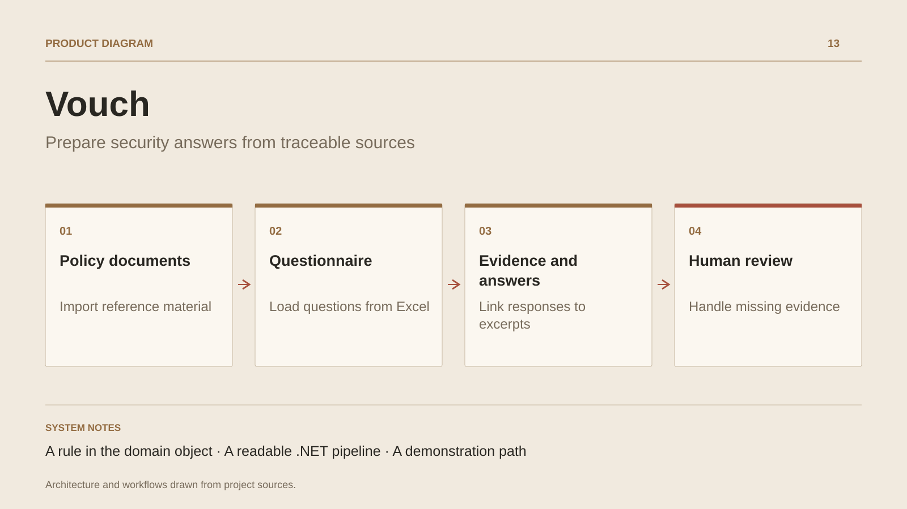

# Vouch

**Prepare security answers from traceable sources**

[All projects](../README.en.md#the-whole-workshop) · [Français](vouch.md)

Vouch explores a concrete RAG use case: preparing security-questionnaire answers from internal company documents. The documented flow imports, chunks and indexes policies; questions from an Excel file then retrieve excerpts and produce draft answers.

The design puts a rule in the Answer object: an answer marked high confidence must include a citation. Insufficient evidence produces an answer flagged for review. A reference supports traceability; human review remains necessary to assess relevance and final wording.

The described architecture separates domain, use cases, infrastructure and web/CLI hosts. The demonstration mode uses deterministic components and an in-memory database to inspect the pipeline. This design study connects document retrieval, business rules and the security team’s validation work.

## Journey

1. Import policies and reference documents.
2. Load questions from an Excel questionnaire.
3. Find useful excerpts and prepare an answer with references.
4. Review answers and handle questions with insufficient evidence.

## Design decisions

### A rule in the domain object

The documented Answer.CreateDraft excerpt rejects a high-confidence answer without a citation. Citation presence remains separate from answer correctness.

### A readable .NET pipeline

The design separates import, chunking, indexing, retrieval and generation behind application ports. Infrastructure and AI providers stay outside the domain.

## Technology

C# · .NET · EF Core · pgvector · AI · CLI

**Status :** AI prototype · documents, citations and evaluation.

[Back to the workshop](../README.en.md#the-whole-workshop) · [Studio & services ↗](https://floriansola.fr/en)
