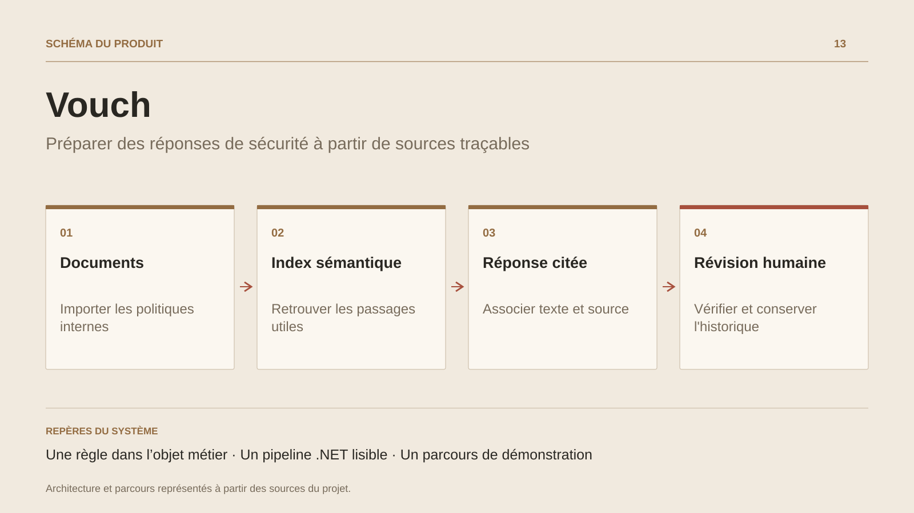

# Vouch

**Préparer des réponses de sécurité à partir de sources traçables**

[Tous les projets](../README.md#tout-latelier) · [English](vouch.en.md)

Vouch explore un usage concret du RAG : préparer les réponses aux questionnaires de sécurité à partir des documents internes d’une entreprise. Le parcours documenté importe les politiques, les découpe et les indexe ; les questions d’un fichier Excel servent ensuite à retrouver des passages et à préparer des réponses.

La conception place une règle dans l’objet Answer : une réponse déclarée à confiance haute doit comporter une citation. Les preuves insuffisantes conduisent à une réponse signalée pour examen. Une référence améliore la traçabilité ; la revue humaine reste nécessaire pour vérifier sa pertinence et la formulation finale.

L’architecture décrite sépare domaine, cas d’usage, infrastructure et hôtes web/CLI. Le mode de démonstration utilise des composants déterministes et une base en mémoire pour examiner le pipeline. Cette étude relie recherche documentaire, règles métier et travail de validation de l’équipe sécurité.

## Parcours

1. Importer les politiques et les documents de référence.
2. Charger les questions d’un questionnaire Excel.
3. Rechercher les passages utiles et préparer une réponse avec références.
4. Examiner les réponses et traiter les questions dont les preuves sont insuffisantes.

## Décisions de conception

### Une règle dans l’objet métier

L’extrait documenté de Answer.CreateDraft refuse une réponse à confiance haute sans citation. La présence d’une citation reste distincte de la justesse de la réponse.

### Un pipeline .NET lisible

La conception sépare import, découpage, indexation, recherche et génération derrière des ports applicatifs. Infrastructure et fournisseurs IA restent en périphérie du domaine.

## Technologies

C# · .NET · EF Core · pgvector · IA · CLI

**État :** Prototype IA · documents, citations et évaluation.

[Retour à l’atelier](../README.md#tout-latelier) · [Studio & services ↗](https://floriansola.fr)
