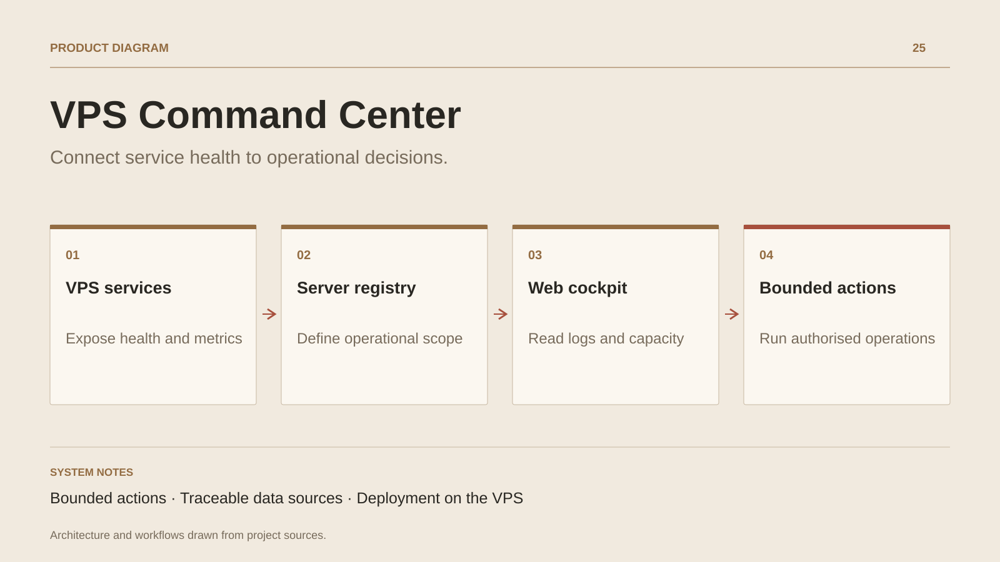

# VPS Command Center

**Connect service health to operational decisions.**

[All projects](../README.en.md#the-whole-workshop) · [Français](vps-command-center.md)

VPS Command Center brings daily operations into one interface: understand service health, find useful logs, assess available capacity and identify the next action. Availability, security, data quality and cost views make these concerns accessible together.

The cockpit also supports action. Resident commands use server-defined targets and arguments. For allowed applications, the delivery module builds on the VPS and follows installation through the health check. Auth0 identity, sessions and CSRF checks govern mutating requests.

The project serves as the control desk for a personal infrastructure. Documentation screenshots produced in mock mode show the interface with synthetic data and should retain that label wherever they appear.

## Journey

1. Inspect services, resources and availability signals.
2. Review incidents, logs and recovery priorities.
3. Run an authorised action or follow an application deployment.

## Design decisions

### Bounded actions

The server selects commands and arguments from a registry. Target identity and privileges remain controlled on the server.

### Traceable data sources

System metrics, application data and optional integrations feed distinct views. Missing sources remain visible.

## Technology

Node.js · Fastify · Linux · systemd · Auth0

**Status :** Internal tool · VPS monitoring and deployment.

[Back to the workshop](../README.en.md#the-whole-workshop) · [Studio & services ↗](https://floriansola.fr/en)
