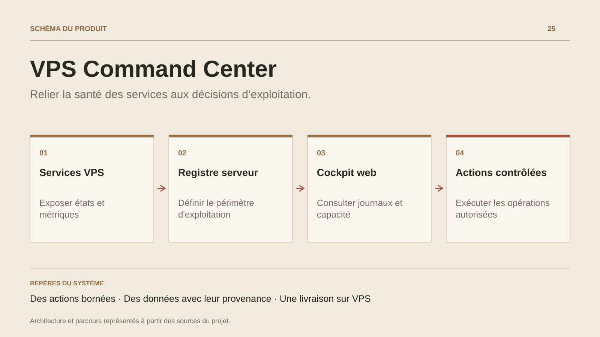

# VPS Command Center

**Relier la santé des services aux décisions d’exploitation.**

[Tous les projets](../README.md#tout-latelier) · [English](vps-command-center.en.md)

VPS Command Center rassemble le travail quotidien d’exploitation : comprendre la santé d’un service, retrouver les journaux utiles, estimer la capacité disponible et identifier la prochaine action. Les vues de disponibilité, de sécurité, de qualité des données et de coûts rendent ces sujets consultables depuis une même interface.

Le cockpit va jusqu’à l’action. Les commandes résidentes passent par une liste de cibles et d’arguments définie côté serveur. Pour les applications autorisées, le module de livraison construit sur le VPS et suit l’installation puis le contrôle de santé. L’identité Auth0, la session et le contrôle CSRF encadrent les requêtes mutantes.

Ce projet constitue le poste de conduite de l’infrastructure personnelle. Les captures documentaires en mode mock montrent l’interface avec des données synthétiques ; elles doivent conserver cette indication lorsqu’elles sont utilisées.

## Parcours

1. Observer les services, les ressources et les signaux de disponibilité.
2. Examiner les incidents, les journaux et les priorités de reprise.
3. Lancer une action autorisée ou suivre la livraison d’une application.

## Décisions de conception

### Des actions bornées

Le serveur choisit les commandes et leurs arguments depuis un registre. L’identité de la cible et les privilèges restent contrôlés côté serveur.

### Des données avec leur provenance

Les métriques système, les données applicatives et les sources optionnelles alimentent des vues distinctes. Une source absente reste identifiable.

## Technologies

Node.js · Fastify · Linux · systemd · Auth0

**État :** Outil interne · supervision et livraison sur VPS.

[Retour à l’atelier](../README.md#tout-latelier) · [Studio & services ↗](https://floriansola.fr)
